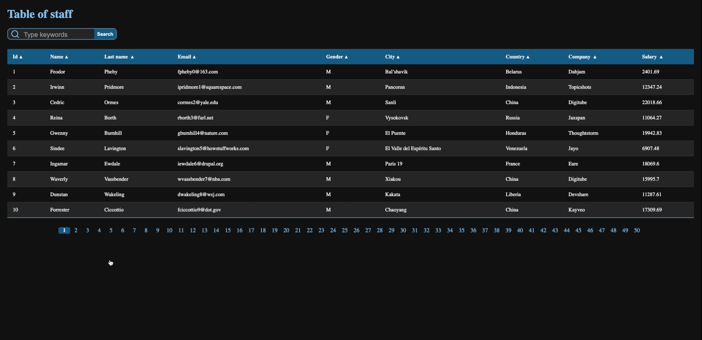

# staff-table

# What is staff-table?

In this project I learned how to use the AXIOS API to retrieve my data and display it in a table called _staff_

# Technologies 🏷️

# Functionalities 💫

- When the search button is pressed, the results are showed up.
- Pagination links update depending on the number of search results.
- Sort table both numerically and alphabetically

# Future features ⏱️

-Pagination show only first 3 pages
